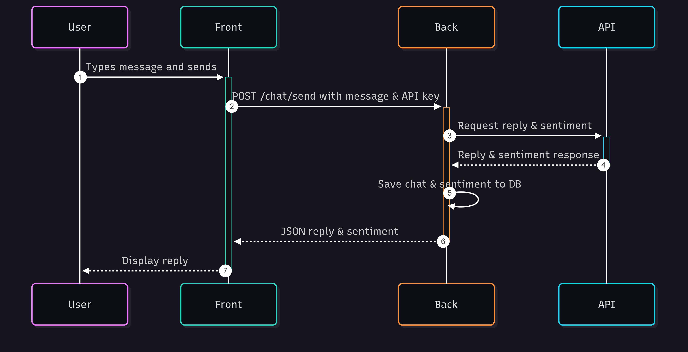

> Author: [Sitanshu Shrestha](https://github.com/itssitanshu)  
> Developed for STEAM Club's Web-Development Competition. Team: Aaditya Poudel, Kritistha Kathiwada, Vision Sapkota      
>   
> [EXAMPLE OF IMPLEMENTATION in HTML/CSS/JS ](example.html) `(click)`

## Features

* **Intelligent Replies:** Context-aware responses via Google Gemini 1.5 Flash model.
* **Sentiment Analysis:** Classifies user messages as Positive, Negative, or Neutral.
* **Persistent History:** Saves conversations for retrieval and analysis.
* **Sentiment Analytics:** Aggregate sentiment data over time.
* **Secure:** API key authentication for clients.
* **Modular Architecture:** Backend is headless; frontend handles UI.

## [Architecture Overview](https://www.mermaidchart.com/app/projects/0591ab66-2cfb-4625-a588-286eaf9e46ed/diagrams/8fe576e4-af37-475a-be17-b5a169e503ec/version/v0.1/edit)

[](https://www.mermaidchart.com/app/projects/0591ab66-2cfb-4625-a588-286eaf9e46ed/diagrams/8fe576e4-af37-475a-be17-b5a169e503ec/version/v0.1/edit)

* Frontend handles UI only, no AI or DB logic.
* Backend manages AI calls, business logic, DB storage, and secrets.
* Keeps sensitive keys secure on the server side.


## Project Structure

```
vision-team/
├──app
  ├── config.py
  ├── __init__.py
  └── v1
      ├── docs
      │   ├── chat_history.yml
      │   ├── chat_send.yml
      │   └── sentiment_analytics.yml
      ├── __init__.py
      ├── models.py
      ├── routes.py
      ├── schemas.py
      └── services.py
├── .env.example              
├── .env                    
├── requirements.txt          
└── run.py                  
```


## Backend Setup & Installation (Local with pip)

### Prerequisites

* Python 3.10 or higher
* pip (comes with Python)

### Step 1: Clone the repo

```bash
git clone https://github.com/triyog-steam-club/webdev-monsoon-25
cd vision-team
```

### Step 2: Create & activate a virtual environment

```bash
python -m venv venv
source venv/bin/activate   # Linux/macOS
venv\Scripts\activate      # Windows
```

### Step 3: Install dependencies

```bash
pip install -r requirements.txt
```

### Step 4: Configure environment variables

Copy the example environment file:

```bash
cp .env.example .env
```

Edit `.env` and add your secret keys:

```dotenv
SECRET_KEY=your-random-secret-key
X_API_KEY=my-super-secret-frontend-key
GEMINI_API_KEY=your-google-gemini-api-key
FLASK_ENV=development
```

* Generate a secure `SECRET_KEY` (e.g., use Python `secrets.token_urlsafe(32)`)
* `X_API_KEY` is what your frontend must send as `X-API-Key` header
* `GEMINI_API_KEY` is your Google AI Studio API key for Gemini

### Step 5: Run the server

```bash
python run.py
```

Your API will be accessible at:

```
http://127.0.0.1:5000/
```

Swagger UI docs available at:

```
http://127.0.0.1:5000/docs/
```

## Usage

* Frontend sends POST to `/v1/chat/send` with JSON:

```json
{
  "user_id": "user123",
  "message": "Hello, how are you?"
}
```

* Include header:

```
X-API-Key: my-super-secret-frontend-key
```

* Backend replies with:

```json
{
  "reply": "I'm good, thanks!",
  "sentiment": "Positive"
}
```


## Notes

* This backend is **headless**; build your own frontend or integrate with any client.
* Store `.env` safely, **never commit secrets**.
* For production, consider using a production-ready WSGI server (e.g., Gunicorn) and HTTPS.